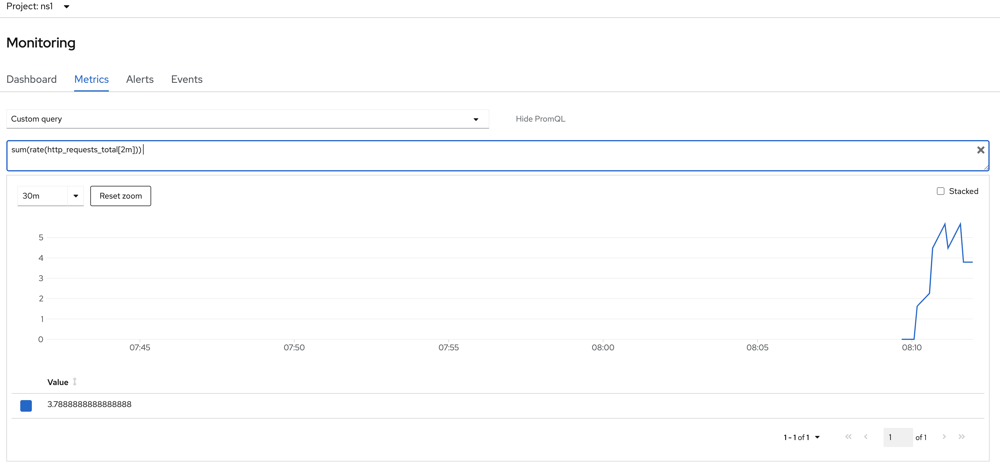
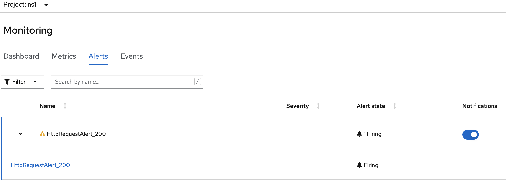

# User Defined Monitoring

Official Documentation: https://docs.openshift.com/container-platform/4.6/monitoring/configuring-the-monitoring-stack.html#preparing-to-configure-the-monitoring-stack

## General

There are 2 namespaces which host and configure the monitoring stack

1. **openshift-monitoring**: the cluster monitoring
2. **openshift-user-workload-monitoring**: the components for user-defined monitoring. Not activated by default.

Both are managed with a ConfigMap, which must be created first.

Example of possible configuration:

```yaml
prometheus: 
      retention: 24h 
      resources:
        requests:
          cpu: 200m 
          memory: 2Gi
```

What can be configured?

https://docs.openshift.com/container-platform/4.6/monitoring/configuring-the-monitoring-stack.html#configurable-monitoring-components_configuring-the-monitoring-stack

## Enable User-Defined Monitoring

### Create a cluster monitoring ConfigMapto be able to configure the monitoring stack

1. Check if ConfigMap already exists:

```bash
oc -n openshift-monitoring get configmap cluster-monitoring-config
```

2. Create the following ConfigMap or modify the existing one:

```yaml
cat <<EOF > monitoring-cm.yaml
apiVersion: v1
kind: ConfigMap
metadata:
  name: cluster-monitoring-config
  namespace: openshift-monitoring
data:
  config.yaml: |
EOF
```

### Create user-defined workload ConfigMap

**Will ONLY be activated once the cluster monitoring stack enabled user-defined monitoring**

1. Check if already exists:

```bash
oc -n openshift-user-workload-monitoring get configmap user-workload-monitoring-config
```

2. Create:

```yaml
cat << EOF > user-defined-monitoring-cm.yaml
apiVersion: v1
kind: ConfigMap
metadata:
  name: user-workload-monitoring-config
  namespace: openshift-user-workload-monitoring
data:
  config.yaml: |
EOF
```

### Enable user-defined monitoring

1. Check existing configuration

```bash
oc -n openshift-monitoring get configmap cluster-monitoring-config -o yaml
```

2. Add enableUserWorkload: true

```yaml
data:
  config.yaml: |
    enableUserWorkload: true
```

3. Check if Pods are starting

```bash
oc -n openshift-user-workload-monitoring get pod

NAME                                  READY   STATUS    RESTARTS   AGE
prometheus-operator-8d4d69888-vvwhv   2/2     Running   0          39s
prometheus-user-workload-0            5/5     Running   1          35s
prometheus-user-workload-1            5/5     Running   1          35s
thanos-ruler-user-workload-0          3/3     Running   0          31s
thanos-ruler-user-workload-1          3/3     Running   0          31s
```

### Permissions

To allow developers to monitor their own project, the following roles must be considered

- monitoring-rules-view
- monitoring-rules-edit ... can modify PrometheusRule
- monitoring-edit  ... can modify PrometheusRule and ServiceMonitor and PodMonitor

## How do I get my metrics?

A developer must expose metrics through service endpoints via http at **/metrics**

For Example:

```bash
# HELP http_requests_total Count of all HTTP requests
# TYPE http_requests_total counter
http_requests_total{code="200",method="get"} 4
http_requests_total{code="404",method="get"} 2
# HELP version Version information about this binary
# TYPE version gauge
version{version="v0.1.0"} 1
```

## Create an example namespace

This will create the namespace _ns1_ with a simply application exposing above metric

```yaml
cat << EOF > example-user-defined-monitoring-project.yaml
apiVersion: v1
kind: Namespace
metadata:
  name: ns1
---
apiVersion: apps/v1
kind: Deployment
metadata:
  labels:
    app: prometheus-example-app
  name: prometheus-example-app
  namespace: ns1
spec:
  replicas: 1
  selector:
    matchLabels:
      app: prometheus-example-app
  template:
    metadata:
      labels:
        app: prometheus-example-app
    spec:
      containers:
      - image: quay.io/brancz/prometheus-example-app:v0.2.0
        imagePullPolicy: IfNotPresent
        name: prometheus-example-app
---
apiVersion: v1
kind: Service
metadata:
  labels:
    app: prometheus-example-app
  name: prometheus-example-app
  namespace: ns1
spec:
  ports:
  - port: 8080
    protocol: TCP
    targetPort: 8080
    name: web
  selector:
    app: prometheus-example-app
  type: ClusterIP
EOF
```

## Specifying how a service is monitored

There are two possible objects which must be considered:

1. **ServiceMonitor**: defines how a service shall be monitored
2. **PodMonitor**: defines how a pod shall be monitored, for example a group of Pods of a DaemonSet

Let's create a ServiceMonitor:

```yaml
cat <<EOF > example-app-service-monitor.yaml
apiVersion: monitoring.coreos.com/v1
kind: ServiceMonitor
metadata:
  labels:
    k8s-app: prometheus-example-monitor
  name: prometheus-example-monitor
  namespace: ns1
spec:
  endpoints:
  - interval: 30s
    port: web
    scheme: http
  selector:
    matchLabels:
      app: prometheus-example-app
EOF
```

Check:

```bash
oc -n ns1 get servicemonitor
```

## Test your  custom metric

### 1st Example

```bash
oc expose svc prometheus-example-app

while true; do curl http://prometheus-example-app-ns1.apps.ocp.aws.ispworld.at/ ; done

sum(rate(http_requests_total[2m]))
```



### 2nd Example

Database monitoring: https://michaelkotelnikov.medium.com/monitoring-services-in-openshift-using-prometheus-25a7fe81f3a9

## Custom Alerting Rules

**Optimizing alerting for user-defined projects**: https://docs.openshift.com/container-platform/4.7/monitoring/managing-alerts.html#Optimizing-alerting-for-user-defined-projects_managing-alerts

### Simple Example

```yaml
cat <<EOF > custom_alerting_rule_1.yaml
apiVersion: monitoring.coreos.com/v1
kind: PrometheusRule
metadata:
  name: example-alert
  namespace: ns1
spec:
  groups:
  - name: example
    rules:
    - alert: VersionAlert
      expr: version{job="prometheus-example-app"} == 0
EOF
```

### Example with http requests

```yaml
cat <<EOF > custom_alerting_rule_2.yaml
apiVersion: monitoring.coreos.com/v1
kind: PrometheusRule
metadata:
  name: example-alert-2
  namespace: ns1
spec:
  groups:
  - name: example
    rules:
    - alert: HttpRequestAlert_200
      expr: (sum(http_requests_total{code="200",method="get",job="prometheus-example-app"})) > 2000
EOF
```

Run while loop until 2000 requests have been reached:

```bash
while true; do curl http://prometheus-example-app-ns1.apps.ocp.aws.ispworld.at/ ; done
```

